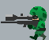
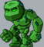
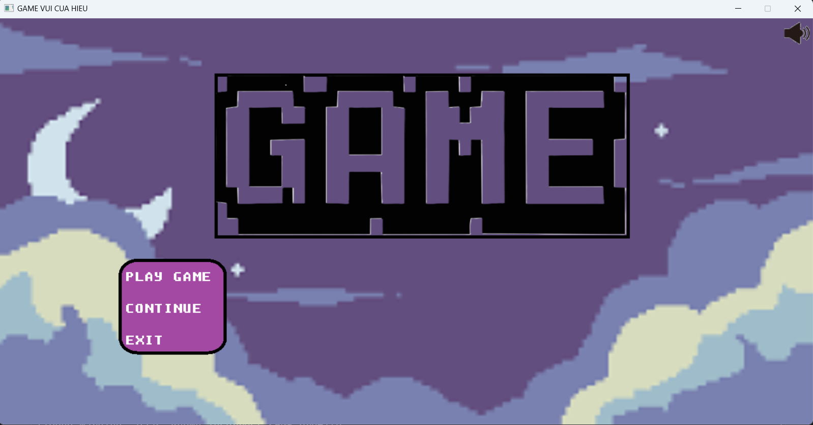
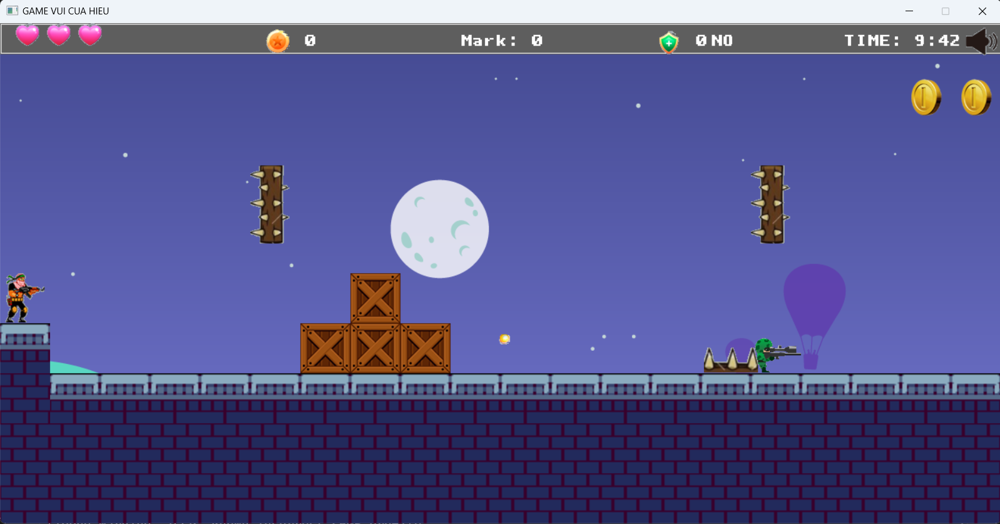

# Game_Ban_Sung_Ve_Dich
The game uses `SDL 2.0`libraries and `C`, `C++`.
# Information
Implementer: Nguyễn Trọng Hiếu.\
ID: 23020069.\
Email: nguyentronghieu2kk5@gmail.com
# Game
The game builds characters to overcome obstacles, trap, destroy enemies and bosses to reach the finish line.
## Main Player
Use `A`, `D` to move.\
Use `J` to jump.\
Use `K` to shoot bullets.\
Use `L` to change bullets.\
Use `I` to place the wall.\
Use `O` to turn on the shield.
## Other Objects
### Enemy

### Obstacles

### Boss

### Items
When you accumulate 500 points, you will gain 1 life if you do not have 3 lives.\

### Game photos

# Demo
[Link video demo](https://youtu.be/hwJVVEBRFxc)
# Credits
## Thanks to:
All teachers in course INT2215 51 - Advanced Programming.\
[Phattrienphanmem123az](https://phattrienphanmem123az.com/) guide to SDL 2 libraries.\
[SDL2](https://www.libsdl.org/) for their library.
## In this game, I used:
Images on Internet.\
Canva for creating images.\
[Fonts](https://fonts.google.com/) for some text in my game.\
[Music](https://poki.com/en/music)\
[Sound effects](https://mixkit.co/free-sound-effects/game/)
